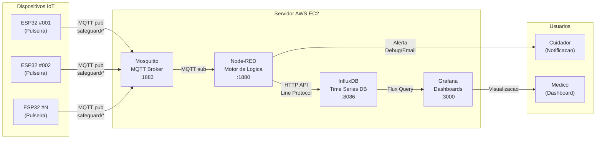
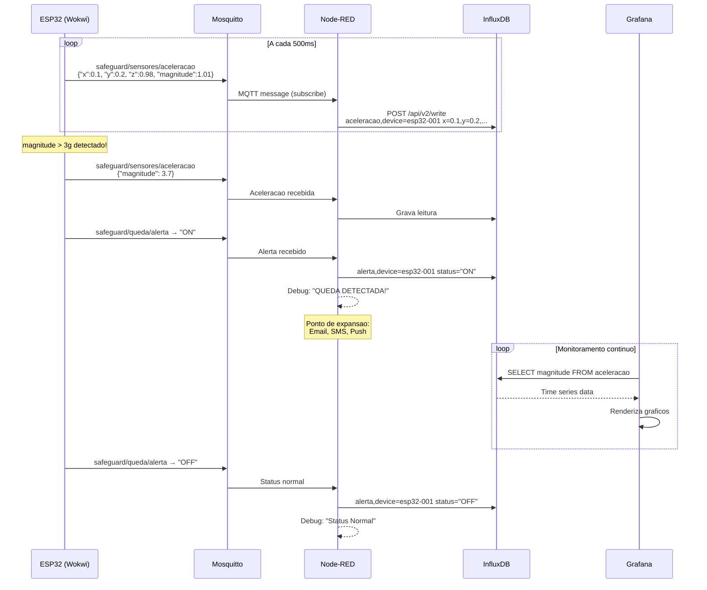
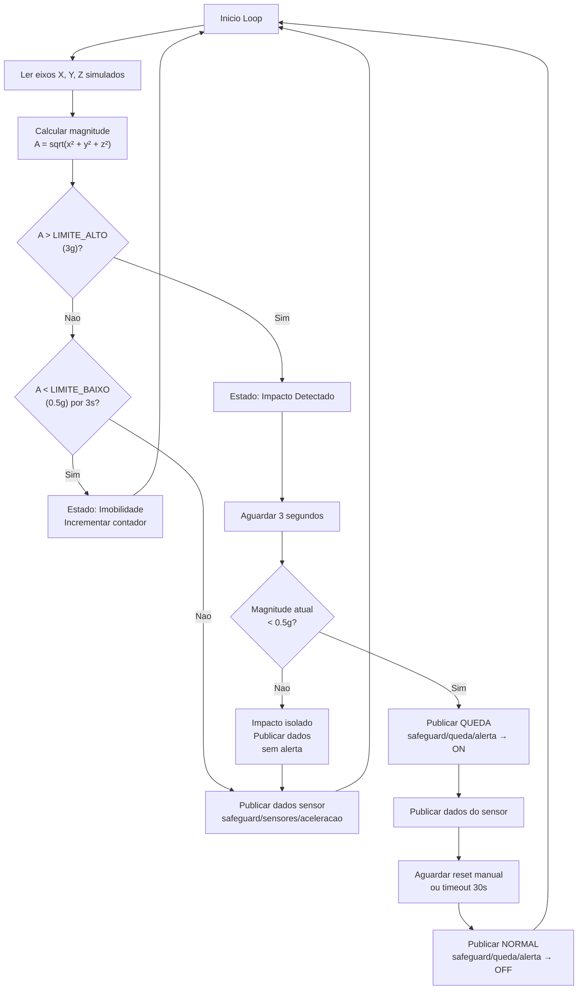
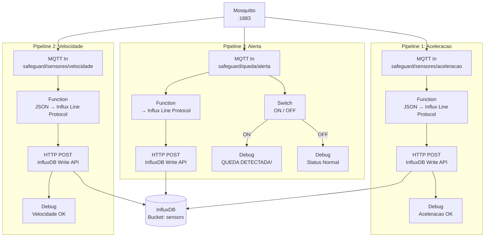
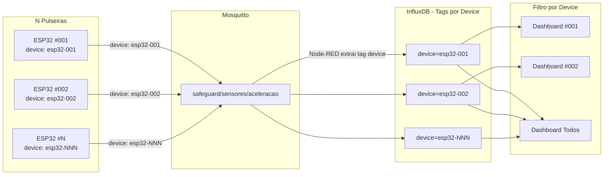

# SafeGuard - Diagramas de Arquitetura

## 1. Arquitetura Geral do Sistema



## 2. Fluxo de Dados Detalhado



## 3. Logica de Deteccao de Queda (Firmware ESP32)



## 4. Pipeline Node-RED (3 Pipelines Paralelas)



## 5. Estrutura dos Topicos MQTT

```mermaid
graph TD
    ROOT["safeguard/"] --> SENSORES["sensores/"]
    ROOT --> QUEDA["queda/"]

    SENSORES --> ACEL["aceleracao<br/>─────────────<br/>Tipo: JSON<br/>QoS: 1<br/>Pub: ESP32<br/>Sub: Node-RED"]
    SENSORES --> VEL["velocidade<br/>─────────────<br/>Tipo: JSON<br/>QoS: 1<br/>Pub: ESP32<br/>Sub: Node-RED"]

    QUEDA --> ALERTA["alerta<br/>─────────────<br/>Tipo: String ON/OFF<br/>QoS: 1<br/>Pub: ESP32<br/>Sub: Node-RED"]

    ACEL --> |"Payload"| ACEL_P["{<br/>  x: float,<br/>  y: float,<br/>  z: float,<br/>  magnitude: float,<br/>  device: string<br/>}"]
    VEL --> |"Payload"| VEL_P["{<br/>  velocidade: float,<br/>  device: string<br/>}"]
    ALERTA --> |"Payload"| ALERTA_P['"ON" ou "OFF"']

    style ROOT fill:#1a1a2e,color:#fff
    style SENSORES fill:#16213e,color:#fff
    style QUEDA fill:#e94560,color:#fff
    style ACEL fill:#0f3460,color:#fff
    style VEL fill:#0f3460,color:#fff
    style ALERTA fill:#c70039,color:#fff
```

## 6. Modelo de Dados InfluxDB

```mermaid
erDiagram
    BUCKET["sensors (30 dias)"] ||--o{ ACELERACAO : contem
    BUCKET ||--o{ VELOCIDADE : contem
    BUCKET ||--o{ ALERTA : contem

    ACELERACAO {
        string measurement "aceleracao"
        string tag device "esp32-001, esp32-002..."
        float field x "aceleracao eixo X (g)"
        float field y "aceleracao eixo Y (g)"
        float field z "aceleracao eixo Z (g)"
        float field magnitude "sqrt(x2+y2+z2) (g)"
        timestamp time "ms epoch"
    }

    VELOCIDADE {
        string measurement "velocidade"
        string tag device "esp32-001, esp32-002..."
        float field valor "velocidade derivada"
        timestamp time "ms epoch"
    }

    ALERTA {
        string measurement "alerta"
        string tag device "esp32-001, esp32-002..."
        string field status "ON ou OFF"
        timestamp time "ms epoch"
    }
```

## 7. Dashboard Grafana (Layout dos Painéis)

```mermaid
graph TD
    subgraph DASHBOARD["SafeGuard - Monitoramento (refresh: 5s)"]
        direction LR
        subgraph ROW1["Linha 1"]
            P1["Grafico Temporal<br/>Aceleracao (Magnitude)<br/>threshold: verde→amarelo→vermelho<br/>h:8 w:12"]
            P2["Grafico Temporal<br/>Aceleracao por Eixo<br/>linhas X, Y, Z separadas<br/>h:8 w:12"]
        end
        subgraph ROW2["Linha 2"]
            P3["Grafico Temporal<br/>Velocidade<br/>h:8 w:12"]
            P4["Painel Status<br/>Atual<br/>verde=NORMAL<br/>vermelho=QUEDA<br/>h:4 w:6"]
            P5["Contador<br/>Total Alertas<br/>verde→amarelo→vermelho<br/>h:4 w:6"]
        end
        subgraph ROW3[""]
            P6["Tabela<br/>Historico de Alertas<br/>ON=QUEDA / OFF=NORMAL<br/>h:8 w:12"]
        end
    end
```

## 8. Multidevice - Como Funciona


